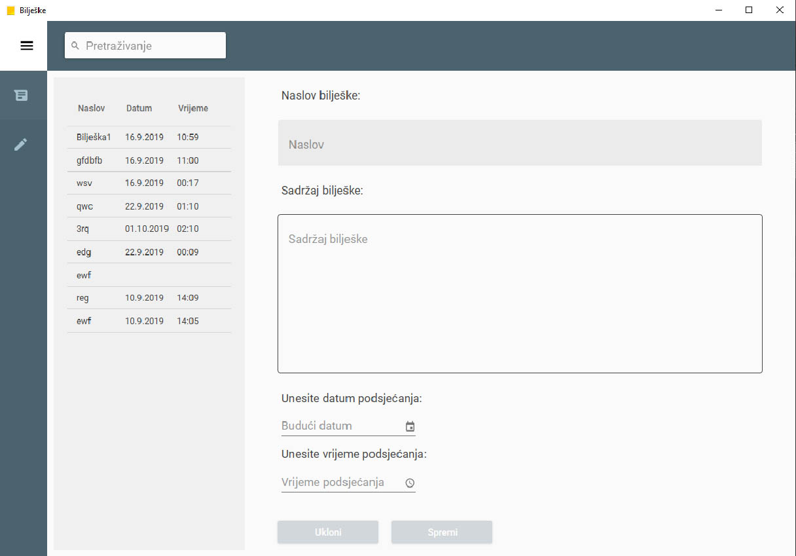

<h1>BiljeskeMaterial</h1>
 

Cilj ovog završnog rada jest prikazati izgradnju aplikacije za praćenje bilješki. Aplikacija posjeduje standardne funkcionalnosti unosa, filtriranja sadržaja te podsjećanja na događaje. 

## Korištene tehnologije

* C# (.NET)
* WPF
* MaterialDesign In XAML
* Quartz

